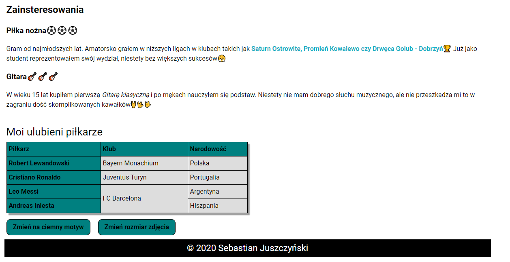

# Homepage
## Demo:

## Live:
https://sebastianjuszczynski.github.io/homepage/
## Technologies:
-  HTML

-  CSS

- &nbsp;&nbsp;JS

### Description:
Website created to train skills in **HTML, CSS and JS.**